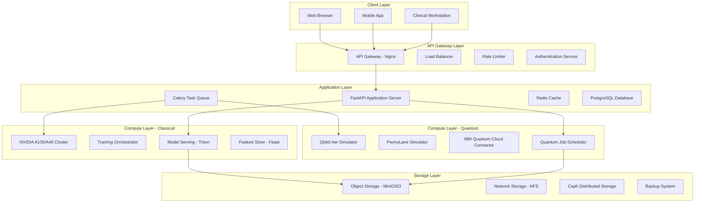
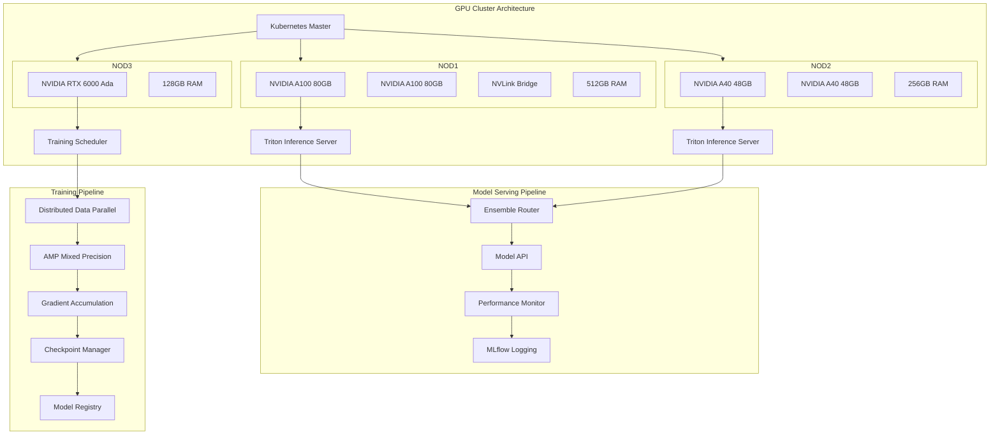
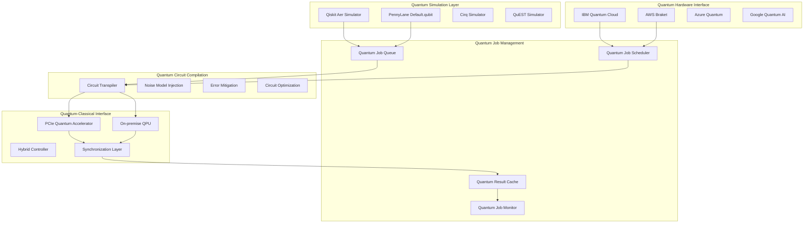
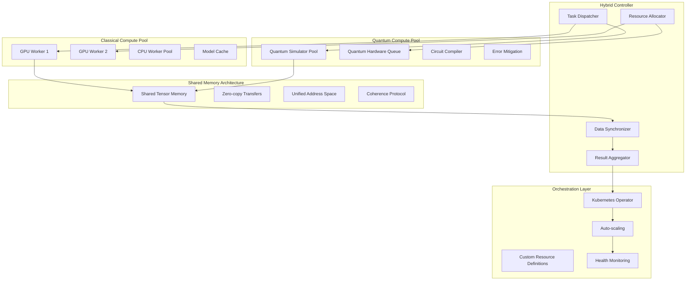

# **Quantum-Classical Hybrid Computing Architecture: Technical Development Requirements**

## **1. System Architecture Overview**

### **1.1 High-Level Architecture**



## **2. Classical ML Infrastructure**

### **2.1 GPU Computing Requirements**



### **2.2 Classical ML Software Stack**

```python
# requirements-ml.txt - Classical ML Dependencies
"""
# Deep Learning Framework
torch==2.1.0+cu118
torchvision==0.16.0+cu118
torchaudio==2.1.0+cu118
torch-tensorrt==2.1.0

# Computer Vision
opencv-python==4.8.1.78
albumentations==1.3.1
scikit-image==0.22.0

# Medical Imaging
pydicom==2.4.3
SimpleITK==2.3.0
monai==1.3.0

# Model Optimization
onnx==1.15.0
onnxruntime-gpu==1.16.3
tensorrt==9.2.0.6

# Distributed Training
accelerate==0.25.0
deepspeed==0.12.6
fairscale==0.4.13

# Model Serving
tritonclient[all]==2.41.0
fastapi==0.104.1
uvicorn[standard]==0.24.0

# Feature Store
feast==0.32.0
hopsworks==3.3.0

# Monitoring
mlflow==2.8.1
wandb==0.16.1
prometheus-client==0.19.0
"""
```

### **2.3 Model Training Pipeline**

```python
# training_pipeline.py - Classical Training
import torch
import torch.distributed as dist
from torch.nn.parallel import DistributedDataParallel as DDP
from torch.cuda.amp import autocast, GradScaler
import deepspeed
import mlflow

class ClassicalTrainingPipeline:
    def __init__(self, config):
        self.config = config
        self.setup_distributed()
        self.setup_mixed_precision()
        
    def setup_distributed(self):
        """Initialize distributed training"""
        dist.init_process_group(backend='nccl')
        self.local_rank = int(os.environ['LOCAL_RANK'])
        self.world_size = dist.get_world_size()
        torch.cuda.set_device(self.local_rank)
        
    def setup_mixed_precision(self):
        """Configure mixed precision training"""
        self.scaler = GradScaler()
        self.amp_dtype = torch.float16
        self.grad_accumulation_steps = 4
        
    def train_epoch(self, model, dataloader, optimizer, scheduler):
        """Single training epoch with advanced features"""
        model.train()
        total_loss = 0
        optimizer.zero_grad()
        
        for batch_idx, (images, labels) in enumerate(dataloader):
            images = images.cuda(non_blocking=True)
            labels = labels.cuda(non_blocking=True)
            
            # Mixed precision forward pass
            with autocast(dtype=self.amp_dtype):
                outputs = model(images)
                loss = self.criterion(outputs, labels)
                loss = loss / self.grad_accumulation_steps
            
            # Gradient accumulation
            self.scaler.scale(loss).backward()
            
            if (batch_idx + 1) % self.grad_accumulation_steps == 0:
                # Gradient clipping
                self.scaler.unscale_(optimizer)
                torch.nn.utils.clip_grad_norm_(
                    model.parameters(), 
                    max_norm=1.0
                )
                
                # Optimizer step
                self.scaler.step(optimizer)
                self.scaler.update()
                optimizer.zero_grad()
                
                # Learning rate scheduling
                scheduler.step()
            
            # Synchronize across GPUs
            dist.all_reduce(loss, op=dist.ReduceOp.SUM)
            total_loss += loss.item() / self.world_size
            
            # Log metrics
            if self.local_rank == 0 and batch_idx % 100 == 0:
                self.log_metrics(batch_idx, loss.item())
        
        return total_loss / len(dataloader)
    
    def log_metrics(self, step, loss):
        """Log training metrics to MLflow/W&B"""
        mlflow.log_metric("training_loss", loss, step=step)
        mlflow.log_metric("learning_rate", 
                         self.scheduler.get_last_lr()[0], 
                         step=step)
        
        # GPU memory monitoring
        gpu_memory = torch.cuda.memory_allocated() / 1e9
        mlflow.log_metric("gpu_memory_gb", gpu_memory, step=step)

class ModelOptimization:
    """Model optimization and deployment utilities"""
    
    @staticmethod
    def optimize_for_inference(model, calibration_data):
        """Apply inference optimizations"""
        # 1. Quantization
        quantized_model = torch.quantization.quantize_dynamic(
            model,
            {torch.nn.Linear, torch.nn.Conv2d},
            dtype=torch.qint8
        )
        
        # 2. ONNX Export
        torch.onnx.export(
            quantized_model,
            calibration_data,
            "model.onnx",
            opset_version=13,
            input_names=['input'],
            output_names=['output'],
            dynamic_axes={'input': {0: 'batch_size'},
                         'output': {0: 'batch_size'}}
        )
        
        # 3. TensorRT Optimization
        trt_model = self.convert_to_tensorrt("model.onnx")
        
        return trt_model
    
    @staticmethod
    def deploy_to_triton(model, model_name, version=1):
        """Deploy model to Triton Inference Server"""
        model_config = """
name: "{model_name}"
platform: "onnxruntime_onnx"
max_batch_size: 32
input [
  {{
    name: "input"
    data_type: TYPE_FP32
    dims: [3, 512, 512]
  }}
]
output [
  {{
    name: "output"
    data_type: TYPE_FP32
    dims: [5]
  }}
]
instance_group [
  {{
    count: 2
    kind: KIND_GPU
    gpus: [0, 1]
  }}
]
dynamic_batching {{
  max_queue_delay_microseconds: 100
}}
""".format(model_name=model_name)
        
        # Save to Triton model repository
        with open(f"/models/{model_name}/{version}/model.onnx", "wb") as f:
            f.write(model.SerializeToString())
        
        with open(f"/models/{model_name}/config.pbtxt", "w") as f:
            f.write(model_config)
```

## **3. Quantum Computing Infrastructure**

### **3.1 Quantum Computing Architecture**



### **3.2 Qiskit Implementation Drafts**

```python
# quantum_circuit.py - Qiskit Implementation
from qiskit import QuantumCircuit, QuantumRegister, ClassicalRegister
from qiskit.circuit import Parameter, ParameterVector
from qiskit.circuit.library import ZZFeatureMap, RealAmplitudes
from qiskit_machine_learning.neural_networks import EstimatorQNN
from qiskit_machine_learning.connectors import TorchConnector
from qiskit.primitives import Estimator
from qiskit_aer import AerSimulator
from qiskit_aer.noise import NoiseModel
import torch
import torch.nn as nn

class QuantumRetinopathyCircuit:
    """Quantum circuit for diabetic retinopathy classification"""
    
    def __init__(self, n_features=30, n_qubits=20, n_layers=3):
        self.n_features = n_features
        self.n_qubits = n_qubits
        self.n_layers = n_layers
        
        # Initialize quantum registers
        self.qr = QuantumRegister(n_qubits, 'q')
        self.cr = ClassicalRegister(n_qubits, 'c')
        self.circuit = QuantumCircuit(self.qr, self.cr)
        
        # Parameterized circuit components
        self.feature_params = ParameterVector('x', n_features)
        self.weight_params = ParameterVector('θ', n_qubits * n_layers * 2)
        
        # Build the circuit
        self.build_circuit()
        
    def build_circuit(self):
        """Construct the variational quantum circuit"""
        
        # 1. Feature encoding layer (angle encoding)
        for i in range(self.n_qubits):
            if i < len(self.feature_params):
                self.circuit.ry(self.feature_params[i], self.qr[i])
            else:
                self.circuit.h(self.qr[i])  # Hadamard for unused qubits
        
        # 2. Variational layers
        param_idx = 0
        for layer in range(self.n_layers):
            # Entanglement layer (linear connectivity)
            for i in range(self.n_qubits - 1):
                self.circuit.cx(self.qr[i], self.qr[i + 1])
            
            # Rotation layer (RY gates)
            for i in range(self.n_qubits):
                self.circuit.ry(self.weight_params[param_idx], self.qr[i])
                param_idx += 1
            
            # Second rotation layer (RZ gates)
            for i in range(self.n_qubits):
                self.circuit.rz(self.weight_params[param_idx], self.qr[i])
                param_idx += 1
            
            # Additional entanglement (circular)
            self.circuit.cx(self.qr[-1], self.qr[0])
        
        # 3. Measurement (expectation values)
        for i in range(self.n_qubits):
            self.circuit.measure(self.qr[i], self.cr[i])
    
    def get_qnn(self):
        """Create Quantum Neural Network interface"""
        
        # Define quantum instance with noise model
        noise_model = self.create_noise_model()
        simulator = AerSimulator(
            noise_model=noise_model,
            shots=1024,
            memory=True
        )
        
        # Create EstimatorQNN
        estimator = Estimator(options={
            "backend": simulator,
            "shots": 1024
        })
        
        qnn = EstimatorQNN(
            circuit=self.circuit,
            input_params=list(self.feature_params),
            weight_params=list(self.weight_params),
            estimator=estimator,
            input_gradients=True
        )
        
        return qnn
    
    def create_noise_model(self):
        """Create realistic noise model for simulation"""
        from qiskit_aer.noise import (
            NoiseModel,
            depolarizing_error,
            thermal_relaxation_error
        )
        
        noise_model = NoiseModel()
        
        # 1-qubit gate errors
        depol_error1 = depolarizing_error(0.001, 1)
        relax_error1 = thermal_relaxation_error(
            t1=100e-6,  # 100 microseconds
            t2=50e-6,   # 50 microseconds
            dt=1e-9     # 1 nanosecond gate time
        )
        
        # 2-qubit gate errors
        depol_error2 = depolarizing_error(0.01, 2)
        
        # Add errors to noise model
        noise_model.add_all_qubit_quantum_error(depol_error1, ['ry', 'rz', 'h'])
        noise_model.add_all_qubit_quantum_error(relax_error1, ['ry', 'rz', 'h'])
        noise_model.add_all_qubit_quantum_error(depol_error2, ['cx'])
        
        return noise_model

class QuantumTorchLayer(nn.Module):
    """PyTorch layer wrapper for quantum circuit"""
    
    def __init__(self, n_features=30, n_qubits=20, n_classes=5):
        super().__init__()
        
        # Classical preprocessing
        self.preprocess = nn.Sequential(
            nn.Linear(n_features, n_qubits),
            nn.Tanh(),
            nn.Linear(n_qubits, n_qubits),
            nn.Tanh()
        )
        
        # Quantum circuit
        self.quantum_circuit = QuantumRetinopathyCircuit(
            n_features=n_qubits,  # Output of preprocessing
            n_qubits=n_qubits,
            n_layers=3
        )
        
        # QNN connector
        self.qnn = TorchConnector(
            self.quantum_circuit.get_qnn(),
            initial_weights=torch.randn(
                self.quantum_circuit.weight_params.size
            )
        )
        
        # Classical post-processing
        self.postprocess = nn.Sequential(
            nn.Linear(n_qubits, 64),
            nn.ReLU(),
            nn.Dropout(0.1),
            nn.Linear(64, n_classes)
        )
    
    def forward(self, x):
        # Classical preprocessing
        classical_features = self.preprocess(x)
        
        # Quantum processing
        quantum_features = self.qnn(classical_features)
        
        # Classical post-processing
        output = self.postprocess(quantum_features)
        
        return output

class QuantumTrainingPipeline:
    """Training pipeline for quantum models"""
    
    def __init__(self, config):
        self.config = config
        self.setup_quantum_backend()
        
    def setup_quantum_backend(self):
        """Configure quantum backend"""
        if self.config.get('use_hardware', False):
            # Connect to IBM Quantum
            from qiskit_ibm_runtime import QiskitRuntimeService
            
            self.service = QiskitRuntimeService(
                channel='ibm_quantum',
                token=self.config['ibm_token']
            )
            
            # Get least busy backend
            self.backend = self.service.least_busy(
                operational=True,
                simulator=False,
                min_num_qubits=self.config['n_qubits']
            )
        else:
            # Use simulator with noise model
            from qiskit_aer import AerSimulator
            from qiskit_aer.noise import NoiseModel
            
            noise_model = self.create_realistic_noise_model()
            self.backend = AerSimulator(
                noise_model=noise_model,
                shots=2048,
                memory=True
            )
    
    def train_quantum_model(self, model, train_loader, val_loader):
        """Train quantum model with gradient approximation"""
        
        optimizer = torch.optim.Adam(
            model.parameters(),
            lr=0.01,
            weight_decay=1e-4
        )
        
        scheduler = torch.optim.lr_scheduler.CosineAnnealingWarmRestarts(
            optimizer,
            T_0=10,
            T_mult=2
        )
        
        best_val_accuracy = 0
        
        for epoch in range(self.config['quantum_epochs']):
            # Training phase
            model.train()
            train_loss = 0
            
            for batch_idx, (features, labels) in enumerate(train_loader):
                optimizer.zero_grad()
                
                # Forward pass
                outputs = model(features)
                loss = nn.CrossEntropyLoss()(outputs, labels)
                
                # Backward pass (quantum gradients via parameter shift)
                loss.backward()
                
                # Gradient clipping for stability
                torch.nn.utils.clip_grad_norm_(
                    model.parameters(),
                    max_norm=1.0
                )
                
                optimizer.step()
                train_loss += loss.item()
                
                # Log quantum circuit metrics
                if batch_idx % 50 == 0:
                    self.log_quantum_metrics(model, batch_idx)
            
            # Validation phase
            val_accuracy = self.validate_quantum_model(model, val_loader)
            
            # Save best model
            if val_accuracy > best_val_accuracy:
                best_val_accuracy = val_accuracy
                self.save_quantum_model(model, epoch)
            
            scheduler.step()
            
            print(f"Epoch {epoch}: Train Loss = {train_loss:.4f}, "
                  f"Val Accuracy = {val_accuracy:.2f}%")
    
    def log_quantum_metrics(self, model, step):
        """Log quantum-specific metrics"""
        import mlflow
        
        # Circuit depth and gate counts
        circuit_info = model.quantum_circuit.circuit.depth()
        mlflow.log_metric("quantum_circuit_depth", circuit_info, step=step)
        
        # Entanglement metrics
        entanglement_entropy = self.calculate_entanglement(model)
        mlflow.log_metric("entanglement_entropy", 
                         entanglement_entropy, step=step)
        
        # Hardware compatibility metrics
        if hasattr(self, 'backend'):
            backend_properties = self.backend.properties()
            mlflow.log_dict(backend_properties.to_dict(), 
                           "quantum_backend_properties")
```

## **4. Hybrid Computing Infrastructure**

### **4.1 Quantum-Classical Integration**



### **4.2 Hybrid Training Implementation**

```python
# hybrid_training.py - Quantum-Classical Co-training
import torch
import torch.distributed as dist
from torch.nn.parallel import DistributedDataParallel as DDP
from qiskit import transpile
from qiskit_aer import AerSimulator
import numpy as np

class HybridTrainingOrchestrator:
    """Orchestrates quantum-classical hybrid training"""
    
    def __init__(self, config):
        self.config = config
        self.setup_hybrid_infrastructure()
        
    def setup_hybrid_infrastructure(self):
        """Initialize hybrid computing resources"""
        
        # 1. Classical distributed setup
        dist.init_process_group(backend='nccl')
        self.world_size = dist.get_world_size()
        self.rank = dist.get_rank()
        
        # 2. Quantum backend allocation
        if self.rank == 0:  # Master node handles quantum
            self.quantum_backend = self.setup_quantum_backend()
            self.quantum_job_queue = []
        
        # 3. Shared memory setup
        self.setup_shared_memory()
        
    def setup_shared_memory(self):
        """Setup shared memory for quantum-classical data exchange"""
        import multiprocessing as mp
        
        # Shared tensors for features and gradients
        self.shared_features = mp.Array('f', 1000000)  # 1M floats
        self.shared_gradients = mp.Array('f', 100000)
        
        # Locks for synchronization
        self.feature_lock = mp.Lock()
        self.gradient_lock = mp.Lock()
        
    def hybrid_training_step(self, model, batch, optimizer):
        """Single hybrid training step"""
        
        # 1. Classical forward pass
        features, labels = batch
        classical_output = model.classical_forward(features)
        
        # 2. Quantum forward pass (async)
        quantum_future = self.submit_quantum_job(
            features.detach().cpu().numpy()
        )
        
        # 3. Compute classical loss
        classical_loss = self.classical_loss_fn(
            classical_output, labels
        )
        
        # 4. Wait for quantum results
        quantum_output = quantum_future.result()
        quantum_output = torch.tensor(quantum_output).to(features.device)
        
        # 5. Hybrid loss computation
        hybrid_loss = self.compute_hybrid_loss(
            classical_output,
            quantum_output,
            labels,
            model.ensemble_weights
        )
        
        # 6. Backward pass
        hybrid_loss.backward()
        
        # 7. Synchronize quantum gradients
        self.synchronize_quantum_gradients(model)
        
        # 8. Optimizer step
        optimizer.step()
        optimizer.zero_grad()
        
        return hybrid_loss.item()
    
    def submit_quantum_job(self, features):
        """Submit quantum circuit execution"""
        from concurrent.futures import ThreadPoolExecutor
        
        # Compress features for quantum
        compressed_features = self.compress_for_quantum(features)
        
        # Create quantum circuit
        circuit = self.create_quantum_circuit(compressed_features)
        
        # Transpile for target backend
        transpiled_circuit = transpile(
            circuit,
            backend=self.quantum_backend,
            optimization_level=3
        )
        
        # Submit job asynchronously
        executor = ThreadPoolExecutor(max_workers=1)
        future = executor.submit(
            self.execute_quantum_circuit,
            transpiled_circuit
        )
        
        return future
    
    def execute_quantum_circuit(self, circuit):
        """Execute quantum circuit on available backend"""
        
        # Execute on simulator or hardware
        if self.config['use_quantum_hardware']:
            # Submit to IBM Quantum
            from qiskit_ibm_runtime import Sampler
            
            sampler = Sampler(backend=self.quantum_backend)
            result = sampler.run(circuit, shots=1024).result()
            counts = result.quasi_dists[0]
            
        else:
            # Execute on simulator
            simulator = AerSimulator()
            result = simulator.run(circuit, shots=1024).result()
            counts = result.get_counts()
        
        # Process quantum results
        processed_results = self.process_quantum_results(counts)
        return processed_results
    
    def synchronize_quantum_gradients(self, model):
        """Synchronize quantum gradients across nodes"""
        
        # Gather quantum gradients from all nodes
        quantum_grad_list = [
            torch.zeros_like(param.grad) 
            for param in model.quantum_parameters()
        ]
        
        dist.all_gather(quantum_grad_list, model.quantum_gradients)
        
        # Average gradients
        averaged_gradients = [
            sum(grad_list) / self.world_size 
            for grad_list in quantum_grad_list
        ]
        
        # Apply averaged gradients
        for param, avg_grad in zip(model.quantum_parameters(), 
                                  averaged_gradients):
            param.grad = avg_grad

class QuantumHardwareInterface:
    """Interface for real quantum hardware"""
    
    def __init__(self, provider='ibm'):
        self.provider = provider
        self.connect_to_hardware()
        
    def connect_to_hardware(self):
        """Connect to quantum hardware provider"""
        
        if self.provider == 'ibm':
            from qiskit_ibm_runtime import QiskitRuntimeService
            
            self.service = QiskitRuntimeService(
                channel='ibm_quantum',
                token=os.environ['IBM_QUANTUM_TOKEN']
            )
            
            # Get available backends
            self.backends = self.service.backends(
                operational=True,
                simulator=False
            )
            
        elif self.provider == 'aws':
            from braket.aws import AwsDevice
            
            self.device = AwsDevice("arn:aws:braket:::device/quantum-simulator/amazon/sv1")
            
        elif self.provider == 'azure':
            from azure.quantum import Workspace
            
            self.workspace = Workspace(
                subscription_id=os.environ['AZURE_SUBSCRIPTION_ID'],
                resource_group=os.environ['AZURE_RESOURCE_GROUP'],
                name=os.environ['AZURE_QUANTUM_WORKSPACE']
            )
    
    def submit_batch_job(self, circuits, shots=1024):
        """Submit batch of quantum circuits"""
        
        job_config = {
            'shots': shots,
            'memory': True,
            'optimization_level': 3,
            'resilience_level': 1,
            'execution': {'shots': shots}
        }
        
        if self.provider == 'ibm':
            from qiskit_ibm_runtime import Batch
            
            with Batch(backend=self.backends[0], **job_config) as batch:
                for circuit in circuits:
                    batch.run(circuit)
            
            return batch.jobs()
        
        elif self.provider == 'aws':
            # AWS Braket batch execution
            tasks = []
            for circuit in circuits:
                task = self.device.run(circuit, shots=shots)
                tasks.append(task)
            
            return tasks
    
    def monitor_jobs(self, jobs):
        """Monitor quantum job execution"""
        
        job_statuses = []
        for job in jobs:
            status = job.status()
            job_statuses.append({
                'job_id': job.job_id(),
                'status': status.name,
                'queue_position': job.queue_position() if hasattr(job, 'queue_position') else None,
                'creation_time': job.creation_date(),
                'backend': job.backend().name if hasattr(job, 'backend') else 'unknown'
            })
        
        return job_statuses
```

## **5. Infrastructure Requirements**

### **5.1 Hardware Specifications**

| Component | Specification | Quantity | Purpose |
|-----------|---------------|----------|---------|
| **GPU Nodes** | NVIDIA A100 80GB | 4-8 | Classical model training |
| **GPU Nodes** | NVIDIA A40 48GB | 2-4 | Model inference |
| **CPU Nodes** | AMD EPYC 64-core | 8-16 | Data preprocessing |
| **Memory** | 512GB DDR4 | Per GPU node | Large batch training |
| **Storage** | NVMe SSD 10TB | 4+ | Fast data access |
| **Network** | 100GbE InfiniBand | Full mesh | Distributed training |
| **Quantum** | Quantum Simulator | 1+ | Circuit simulation |
| **Quantum** | IBM Quantum Access | 1 | Hardware execution |

### **5.2 Software Stack**

| Layer | Technology | Version | Purpose |
|-------|------------|---------|---------|
| **Orchestration** | Kubernetes | 1.28+ | Container orchestration |
| **ML Platform** | Kubeflow | 2.0+ | ML pipeline management |
| **Quantum SDK** | Qiskit | 0.45+ | Quantum computing |
| **Quantum SDK** | PennyLane | 0.33+ | Hybrid quantum-classical |
| **ML Framework** | PyTorch | 2.1+ | Deep learning |
| **Serving** | Triton | 23.10+ | Model inference |
| **Monitoring** | Prometheus | 2.47+ | Metrics collection |
| **Logging** | Elastic Stack | 8.10+ | Log management |
| **Data Pipeline** | Apache Airflow | 2.7+ | Workflow orchestration |
| **Feature Store** | Feast | 0.32+ | Feature management |

### **5.3 Performance Requirements**

1. **Latency Requirements:**
   - Classical inference: < 100ms per image
   - Quantum simulation: < 5 seconds per batch
   - Hybrid ensemble: < 2 seconds total
   - Report generation: < 10 seconds

2. **Throughput Requirements:**
   - Batch processing: 1000+ images/hour
   - Training throughput: 100+ images/second
   - Quantum simulation: 50+ circuits/hour
   - API requests: 1000+ requests/minute

3. **Availability Requirements:**
   - System uptime: 99.9%
   - Quantum service: 99.5%
   - Data durability: 99.999999%
   - Recovery time: < 15 minutes

### **5.4 Security Requirements**

1. **Data Security:**
   - End-to-end encryption (HIPAA compliant)
   - Secure key management (HSM)
   - Data anonymization for training
   - Audit logging for all accesses

2. **Quantum Security:**
   - Secure quantum key distribution
   - Quantum random number generation
   - Post-quantum cryptography ready
   - Quantum-safe authentication

3. **Infrastructure Security:**
   - Zero-trust network architecture
   - Container security scanning
   - Runtime protection
   - Compliance monitoring (HIPAA/GDPR)

This architecture provides a scalable, performant foundation for both classical ML and quantum computing workloads, with clear separation of concerns and efficient resource utilization.